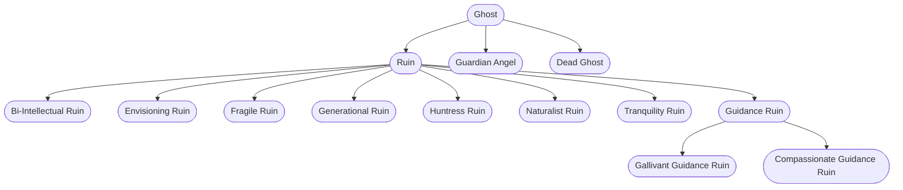

```mermaid
graph TD;
	ghost(["Ghost"])-->ruin(["Ruin"]);
	ghost(["Ghost"])-->Angel(["Guardian Angel"]);
	ghost(["Ghost"])-->dGhost(["Dead Ghost"]);

	ruin-->ruinIntel(["Bi-Intellectual Ruin"]);
	ruin-->ruinEnvis(["Envisioning Ruin"]);
	ruin-->ruinFragile(["Fragile Ruin"]);
	ruin-->ruinGenerational(["Generational Ruin"]);
	ruin-->ruinHuntress(["Huntress Ruin"]);
	ruin-->ruinNaturalist(["Naturalist Ruin"]);
	ruin-->ruinTranquil(["Tranquility Ruin"]);
	ruin-->ruinGuidance(["Guidance Ruin"]);
	ruinGuidance-->ruinGuidance1(["Gallivant Guidance Ruin"]);
	ruinGuidance-->ruinGuidance2(["Compassionate Guidance Ruin"]);

```

